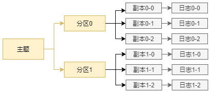

[TOC]


	主题做为消息的归类，可以细分为一个多个分区，分区作为消息的二次归类；
	分区不仅为Kafka提供了可伸缩性，水平扩展的功能，还通过副本机制来为Kafka提供数据冗余以提高可靠性；

从Kafka的底层实现来说，主题和分区都是逻辑的概念，分区可以有多个副本，每个副本对应一个日志文件，每个日志文件对应1到多个日志分段，每个分段可以细分为索引文件，日志存储文件和快照文件等；本章节会涉及如下几个要点：

- 主题的管理
- 初识 KafkaAdminClient
- 分区的管理
- 分区数的选择


## 4.1 主题的管理

主题的管理包括 创建主题，查看主题信息，修改主题和删除主题等操作。可以通过Kafka提供的 kafka-topics.sh 脚本来执行这些操作，这个脚本位于Kafka安装目录的bin下，其核心代码仅有一行：

```sh
exec $(dirname $0)/kafka-run-class.sh kafka.admin.TopicCommand "$@"
```

这种操作的实质是通过 kafka.admin.TopicCommand 类实现主题的管理；

另外还可以通过 KafkaAdminClient的方式实现(本质是调用其 CreateTopicsRequest，DeleteTopicsRequest等方法)；

另外可以通过直接操作日志和zookeeper实现主题的管理操作；

### 4.1.1 创建主题

主题自动创建：如果broker端配置了参数 auto.create.topics.enable=true，那么当生产者向一个不存在的主题发送消息，或者消费者向不存在的主题消费消息的时候，会自动创建相应的主题；主题的分区数目由配置项：num.partitions(默认为1)决定，副本因子由：default.replication.factor(默认为1)决定；

不推荐这种自动创建的方式，因为不确定创建的时机，增加维护和管理的成本；

推荐通过 kafka-topics.sh方式创建主题：

```
bin\windows\kafka-topics.bat --zookeeper localhost:2181/kafka --create --topic topic-create --partitions 3 --replication-factor 1
```

在zookeeper中查看(通过在zk的bin目录下执行zkCli.cmd进入zk的终端)：

```
ls /kafka/brokers/topics/topic-create/partitions
# [0,1,2]
ls /kafka/brokers/topics/topic-create/partitions/0
# [state]
get /kafka/brokers/topics/topic-create/partitions/0/state
# {"controller_epoch":7,"leader":0,"version":1,"leader_epoch":0,"isr":[0]}
```


**通过日志文件的根目录查看主题的分区情况**

在Kafka的broker=0(这里就部署1个节点)的节点的logs目录下，会多出3个分区文件夹，分别为：create-topic-0,create-topic-1,create-topic-2，命名方式采用<topic>-<partition>的方式；

注意：这里的文件夹并不等同于分区，分区和主题一样是一个逻辑概念；这里由于只有1个broker节点，3个分区的数据都放到了broker0处；多节点的情况下，所有的分区数据会分到各个broker节点，另外总共会存放 分区数*副本数 个这样的目录；每一个副本才真正对应一个这样的日志文件；

主题，分区，副本，日志的对应关系如图：



如果broker数为3，创建的该主题的分区数为4，副本数为2，那么副本在各个broker节点上的分配应该是2，3，3的方式；同一个分区的多个副本必须分配到不同的broker中，在创建topic的时候，Kafka会限制副本的数目要小于等于broker数目；


**通过查看zookeeper方式查看主题的分区情况**

```
get /kafka/brokers/topics/topic-create
#{"version":2,"partitions":{"2":[0],"1":[0],"0":[0]},"adding_replicas":{},"removing_replicas":{}}
```

响应中可以看到，当前主题有3个分区，"2":[0] 表示分区2分配到了broker节点0中，只有一个副本；


**通过命令方式查看分配细节**

```
bin\windows\kafka-topics.bat --zookeeper localhost:2181/kafka --describe --topic topic-create
#       Topic: topic-create     PartitionCount: 3       ReplicationFactor: 1    Configs:
        Topic: topic-create     Partition: 0    Leader: 0       Replicas: 0     Isr: 0
        Topic: topic-create     Partition: 1    Leader: 0       Replicas: 0     Isr: 0
        Topic: topic-create     Partition: 2    Leader: 0       Replicas: 0     Isr: 0
```

Topic: Partition: 分别表示当前的主题名称和分区号；Leader: 表示当前分区的主副本所在的broker的编号； Replicas: 表示存放当前分区的所有副本的broker编号的列表，即AR集合；Isr: 即ISR集合；


**指定分配方式**

kafka-topics.sh的 --replica-assignment命令指定，格式为：

```
--replica-assignment broker_id1_for_part1_replica1:broker_id2_for_part1_replica2,broker_id1_for_part2_replica1:broker_id2_for_part2_replica2
```

示例：

```sh
bin\windows\kafka-topics.bat --zookeeper localhost:2181/kafka --create --topic topic-demo-same --replica-assignment 2:0,0:1,1:2,2:1
```

分区之间用逗号分隔，顺序依次递增；

每个分区的不同副本对应的broker的编号之间用 : 分隔；

上述的含义是，分别创建4个分区，每个分区的副本数为2，第一个分区的两个副本分配到broker2和broker1上；

注：如果设置不合理，会报各种错误；


kafka-topic 有5种指令类型：create,list,describe,alter,delete；


**config参数**

设置所创建主题的相关参数

```
--config <String:name1=value1> --config <String:name2=value2>
```

通过 describe命令查看对应的配置信息；


**if-not-exist参数**

Kafka会在创建的时候判断，如果当前主题已经存在就不会再次创建；


**主题的命名规范**

如果主题的名称中含有 . 和_，Kafka会认为它们是一样的；即创建 topic.1_2和topic_1_2的时候，后创建的主题会报错；

因为Kafka内部做埋点的时候根据主题的名称来命名matrices的名称，将 . 字符替换为 _ 使用；

另外，主题的命名同样不建议采用双下划线开头的，因为这表示是Kafka内部的主题，比如 __commit_offsets


**broker的机架信息**

可以在broker端通过配置参数 broker.rack=RACK1 指定机架信息，这样分区副本分配的时候会尽量分配到不同的机架上；


**TopicCommand 方式创建主题**

通过调用 kafka.admin.TopicCommand类，通过向TopicCommand传入一定的关键参数实现主题的管理；

```java
public class TopicCommandDemo {
    public static void main(String[] args) {
        String[] options = new String[]{
                "--zookeeper", "localhost:2128/kafka",
                "--create",
                "--replication-factor", "1",
                "--partitions", "3",
                "--topic", "create-topic-api"
        };
        kafka.admin.TopicCommand.main(options);
    }
}
```

导包：

```xml
 <dependency>
            <groupId>org.apache.kafka</groupId>
            <artifactId>kafka_2.11</artifactId>
            <version>2.0.0</version>
        </dependency>
```

### 4.1.2 分区副本的分配

在创建主题的时候，如果没有指定参数 --replica-assignment ，那么会按照默认的分区的副本分配方案；

内部的分配逻辑，按broker节点上是否配置了机架信息，分为两种；

先考虑未分配机架信息的方案，源码见 kafka.admin.AdminUtils.scala：

```scala
private def assignReplicasToBrokersRackUnaware(nPartitions: Int,
                                                 replicationFactor: Int,
                                                 brokerList: Seq[Int],
                                                 fixedStartIndex: Int,
                                                 startPartitionId: Int): // 起始的分区编号，默认-1
Map[Int, Seq[Int]] = {
    val ret = mutable.Map[Int, Seq[Int]]()
    val brokerArray = brokerList.toArray
    val startIndex = if (fixedStartIndex >= 0) fixedStartIndex else rand.nextInt(brokerArray.length)
    var currentPartitionId = math.max(0, startPartitionId)
    // 指定副本的间隔，目的是为了更加均匀将副本分配到不同的broker上
    var nextReplicaShift = if (fixedStartIndex >= 0) fixedStartIndex else rand.nextInt(brokerArray.length)
    // 轮询所有分区，将每个分区的所有副本分配到不同的broker上
    for (_ <- 0 until nPartitions) {
      if (currentPartitionId > 0 && (currentPartitionId % brokerArray.length == 0))
        nextReplicaShift += 1
      val firstReplicaIndex = (currentPartitionId + startIndex) % brokerArray.length
      val replicaBuffer = mutable.ArrayBuffer(brokerArray(firstReplicaIndex))
      // 保留所有副本分配的broker集合
      for (j <- 0 until replicationFactor - 1)
        replicaBuffer += brokerArray(replicaIndex(firstReplicaIndex, nextReplicaShift, j, brokerArray.length))
      ret.put(currentPartitionId, replicaBuffer)
      // 继续为下一个副本分配
      currentPartitionId += 1
    }
    ret
  }

private def replicaIndex(firstReplicaIndex: Int, secondReplicaShift: Int, replicaIndex: Int, nBrokers: Int): Int = {
    val shift = 1 + (secondReplicaShift + replicaIndex) % (nBrokers - 1)
    (firstReplicaIndex + shift) % nBrokers
  }
```

假设当前场景：3个broker，创建某个主题有3个副本6个分区；

startIndex=2,nextReplicaShift=1,那么，

对于分区0：刚开始 firstReplicaIndex=2，为第1个副本所在的broker的编号，会提前放到broker集合中；第2个副本的broker编号通过 replicaIndex(2,1,0,3)=1；第3个副本的编号为replicaIndex(2,1,1,3)=0；所以partition为0的分配方案是[brokerArray[2],brokerArray[1],brokerArray[0]]


**直接通过zk创建主题**

创建主题的实质是在zookeeper中的 /brokers/topics下创建了和主题关联的子节点写入了副本的分配方案，并且在 /config/topics下创建了主题对应的子节点，并写入主题相关的配置信息(这个动作可以不做)；而Kafka创建主题的实质动作是有控制器完成的。

```
create /brokers/topics/topic-create-zk {"version":1,"partitions":{"2":[1],"1":[1],"0":[1]}}
```

这种方式可以指定特定的分区号，不用必须从0开始；即可以指定分区号为20，30等；


### 4.1.3 查看主题

**list 指令**

```
kafka-topics.sh --zookeeper 127.0.0.1:2128/kafka -list
```

列出当前的所有主题

**describe指令** **topic参数**

describe命令中 --topic 参数可以指定多个主题，逗号分隔


**describe指令  topics-with-overrides**

列出和集群配置不一样的主题


**describe指令 --under-replicated-partitions **

找出所有包含失效副本的分区，此时ISR小于AR集合；这些分区可能正在进行同步，或者节点存在异常；


**describe指令 --unavailable-partitions ** 

可以查看主题中没有leader的副本分区


### 4.1.4 修改主题

修改主题的分区数目和配置等；

**alter指令**

```
kafka-topics.sh --zookeeper 127.0.0.1:1281/kafka -alter --topic topic-config --partitions 4
```

会给出增加分区数的警告，对于消息中含key值的消息而言，发往的分区会发生变化，另外消息的顺序也会有所影响，因此尽量不要随意修改分区数目；

Kafka仅支持分区数目增加，不支持减少，当设置的数目比指定分区数小的时候会报错；如果要支持减少功能，需要的付出的代价很大；


可以添加 --if-exists 参数，控制当前仅在主题存在的情况下生效


**alter指令 --config参数**

可以修改某主题的配置信息

```
kafka-topics.sh --zookeeper 127.0.0.1:2181/kafka -alter --topic topic-config --config max.message.bytes=20000
```


**alter指令 --delete-config 参数**

--delete-config 后面紧跟需要删除(回复默认配置)的参数，如果有多个需要写多个该参数

关于config的操作，新版本中推荐通过 kafka-configs.sh 脚本执行实现


### 4.1.5 配置管理

**kafka-configs.sh** 脚本，不仅可以像kafka-topics.sh 一样 增删改查相关主题，它也可以**修改 broker端，消费者端，客户端相关的参数**

通过参数 entity-type指定操作配置的类型，entity-name指定操作配置的名称

**查看主题**

```
kafka-configs.sh --zookeeper 127.0.0.1:2181/kafka --describe --entity-type topics --entrity-name topic-config
```

--describe 参数表示指令的动作为 查看主题；

--entity-type和--entity-name对应关系为

| --entity-type | --entity-name    |
| ------------- | :--------------- |
| topics        | 对应的主题名称   |
| clients       | 指定clientId的值 |
| users         | 指定用户名       |
| brokers       | 指定brokerId的值 |


**修改主题配置**

alter指令，参数 --add-config 为配置的增改配置 和 --delete-config 为删除相关的配置为默认值

```
kafka-configs.sh --zookeeper 127.0.0.1:2181/kafka -alter --entity-type topic --entity-name topic-config --add-config 属性1=值1,属性2=值2
```

当使用alter指定的时候，会在zookeeper上创建节点 /config/<entity-type>/<entity-name>，值为配置的内容

同时会在zookeeper上的/config/changes节点下创建的持久性的顺序节点 config_change_<seqNo>


### 4.1.6 主题端参数

与主题相关的参数的配置，在broker端都有与之对应

| 主题参数         | 释义                                                         | broker端参数       |
| ---------------- | ------------------------------------------------------------ | ------------------ |
| cleanup.policy   | 日志压缩策略，默认为delete，可以配置为compact                | log.cleanup.policy |
| compression.type | 消息压缩类型，默认值为producer，表示保留生产者中使用的原始类型； | compression.type   |
|                  |                                                              |                    |


### 4.1.7 删除主题

如果确认不再使用一些主题，可以将其删除，释放相关的资源和减少句柄；


**kafka-topics.sh 删除主题**

kafka-topics.sh的delete指令可以用于删除相关的主题；

如果删除的是内部主题，就会报错；可以添加 --if-exists 加以控制

删除的实质动作为，在zookeeper的节点 /admin/delete_topics的路径下创建和主题名称相同的节点，以此标记待删除的主题；真正的删除动作是通过控制器完成的。

```
kafka-topics.sh --zookeeper 127.0.0.1 -delete --topic topic-unknow --if-eixsts
```


**zk删除主题**

因此可以直接操作 /admin/delete_topics节点，达到删除主题的动作

```
create /admin/delete_topics/topic-delete
```


**手动删除**

主题中的元数据存放在zookeeper的  /brokers/topics和/config/topics节点中，消息的内容存放在broker的日志目录中。因此删除这三种数据，也可以达到删除主题的目的；

一旦删除了，就不会回复了；请谨慎操作


## 4.2 初识 KafkaAdminClient

使用API的方式，实现和kafka-topics.sh脚本同样的功能。

### 4.2.1 主题

在前面通过 **TopicCommand** 类创建了主题，但是该方式不能提供给调用者有效的反馈信息。

AdminClient类和AdminUtils类 虽然实现了部分Kafka的管理功能，但是已经过时了。

使用最新的 KafkaAdminClient类(kafka-clients:2.7.0 版本)，它继承了抽象类AdminClient，AdminClient实现了接口Admin，有如下方法：

| 方法                                                         | 解释               |
| ------------------------------------------------------------ | ------------------ |
| public CreateTopicsResult createTopics(final Collection<NewTopic> newTopics) | 创建主题           |
| public DeleteTopicsResult deleteTopics(final Collection<String> topicNames) | 删除主题           |
| public ListTopicsResult listTopics(final ListTopicsOptions options) | 列出所有可用的主题 |
| public DescribeTopicsResult describeTopics(final Collection<String> topicNames) | 查询主题信息       |
| public DescribeConfigsResult describeConfigs(Collection<ConfigResource> configResources) | 查询配置           |
| public AlterConfigsResult alterConfigs(Map<ConfigResource, Config> configs) | 修改配置           |
| public CreatePartitionsResult createPartitions(final Map<String, NewPartitions> newPartitions) | 修改分区           |

#### 创建主题

```java
private static final Logger logger = LoggerFactory.getLogger(KafkaAdminDemo.class);

private static final String ZK_SERVER = "127.0.0.1:2128/kafka";

private static void createTopic() {
    String topic = "topic-admin-api";
    Properties properties = new Properties();
    properties.put(AdminClientConfig.BOOTSTRAP_SERVERS_CONFIG, ZK_SERVER);
    properties.put(AdminClientConfig.REQUEST_TIMEOUT_MS_CONFIG, 30000);
    // 该方法的本质是调用 KafkaAdminClient.createInternal方法，并且返回 KafkaAdminClient 对象
    AdminClient client = AdminClient.create(properties);
    // 创建4个分区，1个副本；还可以设置副本的分配策略，还可以设置主题的相关配置
    NewTopic newTopic = new NewTopic(topic, 4, (short) 1);
    // CreateTopicsResult 中的方法主要是对成员变量  Map<String, KafkaFuture<TopicMetadataAndConfig>> futures 的操作；
    // 它的key表示主题，value表示创建对应主题的响应；可以一次性创建多个主题；
    // XXXTopics的返回值是XXXTopicsResult，listTopics返回值为ListTopicsResponse
    CreateTopicsResult response = client.createTopics(Collections.singleton(newTopic));
    try {
        response.all().get();
    } catch (InterruptedException | ExecutionException e) {
        e.printStackTrace();
    }
}
```

#### 查看主题配置

```java
private static final Logger logger = LoggerFactory.getLogger(KafkaAdminDemo.class);

    private static final String ZK_SERVER = "127.0.0.1:2128/kafka";

    private static void describeConfigs() {
        String topic = "topic-admin-api";
        Properties properties = new Properties();
        properties.put(AdminClientConfig.BOOTSTRAP_SERVERS_CONFIG, ZK_SERVER);
        properties.put(AdminClientConfig.REQUEST_TIMEOUT_MS_CONFIG, 30000);
        // 该方法的本质是调用 KafkaAdminClient.createInternal方法，并且返回 KafkaAdminClient 对象
        AdminClient client = AdminClient.create(properties);
        ConfigResource resource = new ConfigResource(ConfigResource.Type.TOPIC, topic);
        DescribeConfigsResult result = client.describeConfigs(Collections.singleton(resource));
        try {
            Config config = result.all().get().get(resource);
            logger.info("config:{}.", config);
        } catch (InterruptedException | ExecutionException e) {
            e.printStackTrace();
        }
    }
```

#### 修改主题配置

```java
private static void alterConfig() throws ExecutionException, InterruptedException {
        String topic = "topic-admin-api";
        Properties properties = new Properties();
        properties.put(AdminClientConfig.BOOTSTRAP_SERVERS_CONFIG, BROKER_LIST);
        properties.put(AdminClientConfig.REQUEST_TIMEOUT_MS_CONFIG, 30000);
        // 该方法的本质是调用 KafkaAdminClient.createInternal方法，并且返回 KafkaAdminClient 对象
        AdminClient client = AdminClient.create(properties);
        ConfigResource resource = new ConfigResource(ConfigResource.Type.TOPIC, topic);
        //
        ConfigEntry configEntry = new ConfigEntry("cleanup.policy", "compact");
        AlterConfigOp alterConfigOp = new AlterConfigOp(configEntry, AlterConfigOp.OpType.SET);
        Map<ConfigResource, Collection<AlterConfigOp>> configMap = new HashMap<>();
        configMap.put(resource, Collections.singletonList(alterConfigOp));
        AlterConfigsResult result = client.incrementalAlterConfigs(configMap);
        result.all().get();
        logger.info("Alter config success.");
    }
```


#### 添加分区数目

```java
private static final Logger logger = LoggerFactory.getLogger(KafkaAdminDemo.class);

private static final String BROKER_LIST = "127.0.0.1:9092";

private static void addPartitions() throws ExecutionException, InterruptedException {
    String topic = "topic-admin-api";
    Properties properties = new Properties();
    properties.put(AdminClientConfig.BOOTSTRAP_SERVERS_CONFIG, BROKER_LIST);
    properties.put(AdminClientConfig.REQUEST_TIMEOUT_MS_CONFIG, 30000);
    // 该方法的本质是调用 KafkaAdminClient.createInternal方法，并且返回 KafkaAdminClient 对象
    AdminClient client = AdminClient.create(properties);
    //
    NewPartitions partitions = NewPartitions.increaseTo(4);
    Map<String, NewPartitions> newPartitionsMap = new HashMap<>();
    newPartitionsMap.put(topic, partitions);
    CreatePartitionsResult result = client.createPartitions(newPartitionsMap);
    result.all().get();
}
```


### 4.2.2 主题的合法性验证

可以控制用户在创建topic时，按照指定的规范进行；


## 4.3 分区的管理

包括 优先副本的选举，分区重分配，复制限流，修改副本因子等内容；

### 4.3.1 优先副本的选举

分区的多副本机制 提高可靠性；

一个leader副本，多个follower副本；只有leader副本负责消息的读写，follower副本只负责内部消息的同步；

一个broker最多只能存放一个主题的某个分区的一个副本，

当leader副本所在的broker节点宕机后，Kafka需要从余下的follower副本中选择一个作为leader副本对外提供服务；


**优先副本** 指的是 AR集合列表的第一个副本；理想情况下，优先副本就是该分区的leader副本；

**优先副本选举** 是指通过一定的方式，促使优先副本选举为leader副本，以此来促进集群的负载均衡，这一行为也成为"分区均衡";

分区均衡 不意味着Kafka集群的负载均衡，以为需要考虑到消息的分配是否均衡，比如有些分区收发的消息负荷高，而有些分区少；


**Kafka分区自动均衡** broker端配置参数 auto.leader.rebalance.enable=true，默认值为true

如果开启了自动均衡，Kafka的控制器会启动一个定时任务，轮询所有的broker节点，计算每个broker节点的不均衡率(非优先副本的leader数/分区总数)，是否超过leader.imbalance.per.broker.percentage配置的比例，默认10%；如果超过就会自动执行副本的选举动作以求分区平衡，执行的周期有参数leader.imbalance.check.interval.seconds控制，默认300即5分钟；


不过生产环境不建议开启该状态，它会带来额外的性能问题；

脚本控制优先副本选举 **kafka-perferred-replica-election.sh**

它还提供了path-to-json-file参数来小批量地对部分分区执行优先副本额选举操作。生产环境中一般使用该方法分批的手动的执行优先副本的选举；


### 4.3.2 分区重分配

当集群的某个节点宕机下线时，如果节点上的某个分区是单副本的，那么这些分区会不可用，在节点恢复前相应的数据处理丢失状态；如果是多副本的，Kafka集权需要从follower副本中选择一个可用节点的副本作为leader副本对外提供服务；

当要对集群中某个节点执行有计划的关机的时候，为了保证分区及副本的合理分配，我们也希望通过某种方式可以将该节点上的副本迁移到其他可用的节点上；

当有新的broker上线时，只有新创建的主题才有可能分配到这个节点上，而其他节点不会自动分配到新加入的节点，因为它们启动的时候还没有创建这个新节点；这样新节点和之前节点的负载之间严重不均衡。

为了解决上述问题，需要让分区副本再次进行合理的分配，即**分区重分配**；

可使用脚本 kafka-reassign-partitions.sh 可以在集群扩容，或者节点失效的时候对分区进行迁移；3个步骤，1 创建一个包含主题清单的json文件，2 根据主题清单和broker节点清单生成一份重分配方案，3 最后根据这份方案执行具体的分配动作；

。。。

**分区重分配的原理**

控制器为每个分区添加新副本(增加副本因子)，新的副本将从分区的leader那里复制所有数据；复制过程可能小号很多时间，在复制完成后，控制器将旧副本从副本请但真那个移除(恢复副本因子数)。


分区重分配后，可能导致分区不均衡的情况，此时可以通过执行一次预先副本选举动作；


### 4.3.3 复制限流

在上面分区重分配中，会存在大量数据的复制，为了避免在业务峰值的时候大量重分配对系统的影响，这里需要一个限流的机制，对副本间的流量加以控制，保证重分配期间整体服务不会受太大的影响；

实现方式有两个：kafka-configs.sh 和 kafka-reassign-parititons.sh

**kafka-configs.sh**

是通过配置参数的方式实现限流的目的

**在broker级别**有两个配置参数：follower.replication.throttled.rate和leader.replication.throttled.rate，前者用于设置follower副本复制的速度，后者用于设置leader副本传输的速度，单位是B/s；

（注意：这里是操作broker的配置）

```shell
kafka-configs.sh --zookeeper localhost:2182/kafka --entity-type brokers --entity-name 1 --alter --add-config follower.replication.throttled.rate=1024,leader.replication.throttled.rate=1024
```

**命令方式查看**：

```
kafka-configs.sh --zookeeper localhost:2182/kafka --entity-type brokers --entity-name 1 --describe
```

**zk查看**，通过查看  /config/<entity-type>/<entity-name 节点的值：

```
get /config/brokers/1
```

**删除刚才的配置**

```
kafka-configs.sh --zookeeper localhost:2182/kafka --entity-type brokers --entity-name 1 --delete-config follower.replication.throttled.rate,leader.replication.throttled.rate
```


在主题级别也有两个相关的参数限制复制的速度 leader.replication.throttled.replicas,follower.replication.throttled.replicas 配置被限流的leader副本列表，和follower副本列表

```shell
kafka-configs.sh --zookeeper localhost:2181/kafka --entity-type topics --entity-name topic-throttle --alter --add-config leader.replication.throttled.replicas=[0:0,1:1,2:2],follower.replications.throttled.replicas=[0:1,1:2,2:0]
```

0:0,1:1,2:2 表示0分区所在的broker0,1分区所在的broker1，2分区所在的broker2节点的leader副本发送数据的时候被限流；


如何测试？

开启一个生产者，向某个主题发送 一批消息，查看数据复制过程的快慢，限流的分区和非限流的分区对比；


**kafka-reassign-parittions.sh**

脚本限流，推荐使用该方法限流，它会默认配置相关限流的分区信息，只需要在使用过程中添加一个 throttle参数用于控制速度；


注意：限流的主要用途是结合重分配；


### 修改副本因子

可以通过修改副本因子的数目提高容错性和可靠性；

修改副本因子也是使用重分配中使用的脚本 kafka-reassign-parititons.sh 脚本，给定相关的json配置文件


## 4.4 如何选择合适的分区数

最终是要根据实际的业务场景，软件条件，硬件条件，负载情况等来做具体的考量的。

### 4.4.1 性能测试工具

脚本 kafka-producer-perf-test.sh 和 kafka-cnsumer-perf-test.sh 

```
kafka-producer-perf-test.sh --topic topic-1 --number-records 1000000 --record-size 1024 --throughput -1 --producer-props bootstrap.servers=localhost:9092 acks=1
```

number-records 指定消息的总条数；record-size用来设置媒体哦啊消息的字节数；producer-props指定身缠这的配置，可以同时指定多组配置，空格间隔；throughput 用来进行限流，单位B/s，小于0表示不限流，当发送的吞吐量大于该值的时候就会被阻塞一段时间；

```
kafka-consumer-perf-test.sh --topic topic-1 --message 1000000 --broker-list localhost9092
```


### 4.4.2 分区数越多吞吐量越高吗

吞吐量：每单位实现处理的数目，即数据速率；

测试场景，分区数目分别设置1，20，50，100，200，500，1000的主题，3个broker机节点，每个节点4核8G内存40G磁盘，jvm1.8；使用生产者测试脚本分别向这几个主题发送100万条消息，每个消息大小为1k；比较它们的吞吐连，并通过曲线折线图可视化；

结论：刚开始随着分区数目不断增加吞吐量也不断增加，但是当分区数目超过某个阈值后，整体的兔兔两是不升反而降的；

对消费者的测试结果也是一样的。

存在临界值。


### 4.4.3 分区数的上限

尝试在一台普通的Linux机器上创建包含10000个分区的主题，

```sh
kafka-topics.sh --zookeeper localhost:2181/kafka --create --topic topic-bomb --replication-factor 1 --partitions 10000
```

结果 Kafka服务崩溃(ps -aux|grep kafka 找不到任何进程了)；

查看Kafka的logs/server.log 可以看懂大量的异常： too many open files.

这个是linux常见的系统错误，意味着文件描述符不足；

ulimit -n 查看数目，ulimit -Sn 指定资源的软限制， ulimit -Hn 资源的硬限制；硬限制设置后不能修改，软限制可以增加到硬限制的大小；

查看当前的文件描述符：

```
# 先查Kafka的进程号
ps -aux|grep kafka
# 31796 kafka.kafka
ls /proc/31797/fd |wc -l
# 此时新建一个分区的主题后，该数目会加1
```

修改文件描述符数目：

方法1 ulimit 仅在当前有效：

```shell
ulimit -n 65535	
```

方法2 修改limits.conf文件

```
vi /etc/security/limits.conf
```

加入

```
root soft nofile 65535
root hard nofile 65553
```

方式2，修改后需要冲洗才能生效；它可以在任何用户下的任何shell中生效；


### 4.4.4 考量的因素

如何选择一个合适的分区数？


问题：

- 假设某个broker挂掉了，并且当前无法满足配置的副本数的时候会如何？

