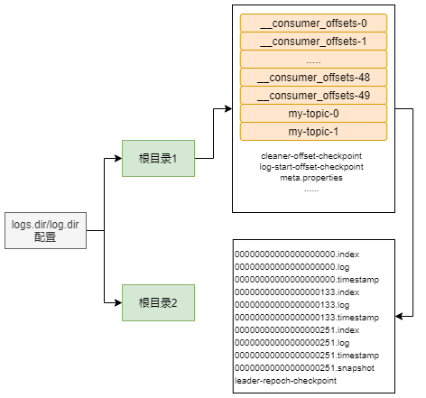
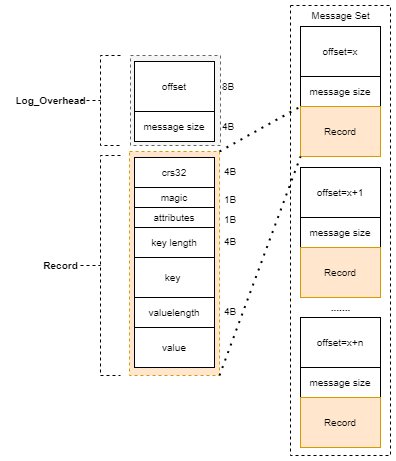
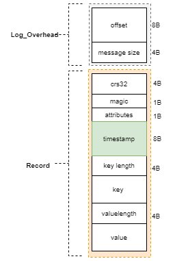
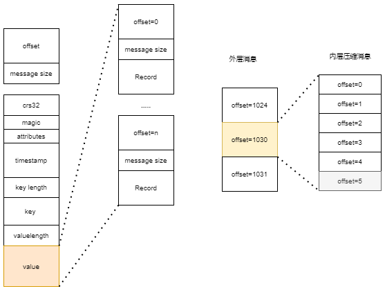
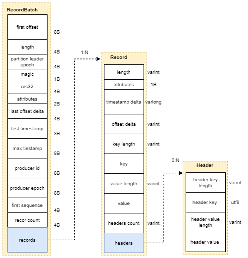
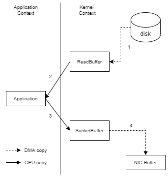

[TOC]


有关Kafka日志存储相关的知识点，我们知道Kafka中的消息是存储在磁盘上的，

- 为什么使用磁盘作为存储介质？
- 具体消息的存储格式又是什么？
- 如何快速检索到指定的消息？
- 消息不可能无限存储，那么清理规则是什么？

# 5.1 文件目录的布局

主题有多个分区，每条消息在发送的时候，会追加到指定的分区中，分区中的每条消息会被分配一个唯一的索引号，即偏移量；

如果分区规则设置合理，那么消息会均匀的分布到不同的分区中；

一个分区副本对应一个Log，为了防止Log过大，有引入LogSegment的概念，LogSegment是逻辑上的概念，它包含一个日志文件(\*.log)和两个索引文件(\*.index)，以及可能的其他文件；


**Log的命名**

<topic-name>-<partition>的文件夹

向Log中追加消息，只有最后一个LogSegment才能执行写入操作，在此之前的所有LogSegment都不能写入数据；当最后一个segment满足一定的条件是，就会创建新的segment，之后的消息都会往它里面追加；


**索引文件**

为了便于消息检索， 每个segment的日志文件(*.log) 都有对应的两个索引文件；偏移量索引文件(\*.index)和时间戳索引文件(\*.timeindex);

每个LogSegment都有一个基准偏移量 baseOffset，用来表示但钱segment 第一条消息的偏移量offset；它是一个64为的长整型数，日志文件和两个索引文件都是根据基准偏移量命名的，名称固定为20位数字，没有达到的位数用0填充，比如第一个LogSegment的基准偏移量为0，对应的日志文件为 00000000000000000000.log；



# 5.2 日志格式的演变

消息的格式如果设计的不够精炼，那么其功能和性能就会大大折扣；

## 5.2.1 v0版本



各字段解释

- **crc32：** crc32校验值，校验范围凑够magic到value之间；
- **magic：**消息格式的版本号，此版本的值为0；
- **attributes：**消息的属性，总共1个字节，低3位表示压缩类型：0表示None,1表示GZIP，2表示SNAPPY,，3表示LZ4，其余位保留；
- **key length：** 消息的key的长度，如果是-1表示没有设置key，key=null；
- **key：** 可选，如果没有key就无该字段；
- value length 和 vale同上；

## 5.2.2 v1版本



比v0版本就多了一个timestamp字段，表示消息的时间戳

vi版本的magic字段的值位1，attributes字段中的第4位被利用起来：0表示timestamp类型位CreateTIme，1表示类型位LogAppendTIme；timestamp类型由broker端参数 log.mesage.timestamp.type 来配置，默认值是CreateTime，即生产者创建消息时的时间戳；如果创建ProducerRecord时没有显示指定消息的时间戳，那么kafkaProducer会在发送消息前自动加上；


## 5.2.3 消息压缩

生产者在发送消息的时候，可以将多条消息压缩成一条消息，然后再发送给broker端；broker端仅是存储不做处理，只有到消费者端才会解压消息，然后再消费；

Kafka日志中采用哪种压缩策略是通过参数 compression.type，默认值是 producer，保留生产者使用的压缩方式，还可以配置位 gzip，snappy，lz4，分别对应其压缩算法，还可以配置位 uncompressed 表示不压缩；



这里的消息压缩compress message，注意和日志清理策略中的compact message做区分；此处的消息压缩单指compress message，即采用压缩算法等压缩工具压缩的消息；后者指日志压缩后的消息；


## 5.2.4 变长字段

v2版本的消息格式变化很大，参考protocol buffer引入了变长整形Varints和ZigZag编码;

**变长类型**

是用一个或多个字节序列化整数的一种方法；数值越少，位数越少；

每个字节的最高位0和1有特殊含义，0表示当前字节是最后一个字节，1表示后面还有当前数的字节；

```shell
# 比如表示 300，二进制形式为 
0000001 00101100
# 改为7位一个字节的数(Base 128编码)
000 0010 010 1100
# 改为小段字节序
0101100 0000010
# 高位标识位
10101100 00000010
```

如果当前数位负数，采用Varints编码，还是会很长；

**ZigZag编码**

是一种以锯齿形方式来回穿梭正负整数，将带符号位的整数映射为无符号整数，这样是的绝对值小的负数依然有较小的Varints编码；

```shell
# 65的编码方式
0100 0001
# ZigZag处理，移位+取绝对值
1000 0010^0000 0000 = 1000 0010
# Varints处理，转换为每个字节7位形式
000 0001 000 0010
# 小段字节调整
000 0010 000 0001
# 调整最高位
1000 0010 000 0001
```

具体的编码实现：

```java
public static void zigZagEncode(int value, ByteBuffer buffer) {
        int v = (value << 1) ^ (value >> 31);
        while ((v & 0xFFFFFF80) != 0L) {
            byte b = (byte) ((v & 0x7F) | 0x80);
            buffer.put(b);
            v >>>= 7;
        }
        buffer.put((byte) v);
    }
```

具体的解码实现：

```java
public static int zigZagDecode(ByteBuffer byteBuffer) {
        int value = 0;
        int i = 0;
        int b;
        int count = 0;
        while (((b = byteBuffer.get(count)) & 0x80) != 0) {
            count++;
            value |= (b & 0x7F) << i;
            i += 7;
            if (i > 28) {
                throw new IllegalArgumentException("---:" + value);
            }
            if (count == byteBuffer.position()) {
                break;
            }
        }
        value |= b << i;
        return (value >>> 1) ^ -(value & 1);
    }
```

**注意：**

varints并不是一直会省空间，一个int32最长会占用5个字节(大于默认的4个字节)，int64最长会占用10个字节(大于默认的8个字节)；

计算一个int32占用的字节个数

```java
public static int intValueSizeOfZigZag(int value) {
        int v = (value << 1) ^ (value >> 31);
        int bytes = 1;
        while ((v & 0xFFFFFF80) != 0L) {
            bytes++;
            v >>>= 7;
        }
        return bytes;
    }
```


## 5.2.5 v2版本

v2中的消息集称为Record Batch，而不是之前的Message Set，其内部也包含了一条或多条消息；

Record Batch Header部分是不被压缩的，而被压缩的是records字段中的所有内容；生产者客户端中的ProducerBatch对应这里的RecordBatch,ProducerRecord对应这里的Record;




v2版本的消息格式去掉了crc字段，另外增加了length(消息长度)，timestamp delta(时间戳增量)，offset delta(位移增量)，和headers信息，并且attributes字段被弃用了；

- length 消息总长度
- attributes 弃用，但还是保留备用；
- timestamp delta 时间戳增量，通常一个时间戳需要8字节，这里保存与RecordBatch的起始时间戳的差值；
- offset delta 位移增量，保存与RecordBatch起始位移的差值，
- headers 用于支持应用级别的扩展，一个Record中有多个Header，每个里面有key和对应的value;

v2版本对消息集做了彻底的修改；

查看日志脚本

```
kafka-dump-log.sh --files logs-dir/topic-name/****.log
# 可以查看到消息的大小
```


# 5.3 日志索引

偏移量索引文件和时间戳索引文件

偏移量索引文件用来建立消息偏移量到物理地址之间的映射关系，方便快速定位消息所在的物理文件位置；

时间戳索引文件则根据指定时间戳来查找对应的偏移量信息；

Kafka中的索引文件是以稀疏索引的方式构造消息的索引，每当写入一定量(log.index.interval.bytes指定，默认位4096，即4KB)的消息后，偏移量索引文件和时间戳索引文件会分别增加一个偏移量索引项和时间戳索引项；


## 5.3.1 偏移量索引

每个索引项占用8个字节，分为两个部分，

- relativeOffset 相对偏移量先对于baseOffset的偏移量，4个字节，当前索引的文件名即为baseOffset的值；
- position 物理地址，消息在日志分段文件中对应的物理位置，4个字节；

当追加的消息的偏移量与当前日志分段的偏移量之间的差值大于了Integer.MAX_VALUE，那么日志分段文件会被切分；


## 5.3.2 时间戳索引

每个索引项12个字节，当前日志分段最大的时间戳，时间戳对应的消息的相对偏移量；

步骤1：根据指定的时间戳，找到不小于指定时间戳的日志分段(log,index,timeindex文件)；

步骤2：在时间戳文件中，采用二分查找方式，找到不大于指定时间戳的最大索引项读取对应的偏移量；

步骤3：在偏移量索引文件中，根据二分查找找到不大于指定偏移量的最大索引项，得到对应的log文件中的位置；

步骤4：从日志文件中找到对应位置的，然后开始查找不小于指定时间戳的消息；


# 5.4 日志清理

Kafka将消息存储在磁盘中，为了控制磁盘占用空间的不断增加就需要对消息做一定的清理操作；

Kafka中每一个分区副本都对应着一个Log，而Log又可以分为多个日志片段，这样也便于日志的清理操作；

Kafka提供两种日志清理策略：

日志删除策略 按照一定的额保留策略直接删除不符合条件的日志分段；

日志压缩策略 针对每个消息的key进行整合，对于有相同key的不同value值，只保留最后一个版本；


通过broker端的log.cleanup.policy来设置日志清理策略，默认为delete，即采用日志清理策略；compact 为日志压缩策略，并且还需要将log.cleaner.enable设置为true；如果policy设置为 delete,compact 两个值，可同时支持日志删除和压缩两种策略；


## 5.4.1 日志删除

Kafka的日志管理器中有一个专门的日志删除任务来周期性的检测和删除不符合保留条件的日志分段文件，这个周期通过参数 log.retention.check.interval.ms配置，默认为300000，即5分钟；

保留策略有3中，基于时间，基于日志大小和基于日志其实偏移量的保留策略；


**基于时间**

日志删除任务会检查当前日志文件中是否有保留时间超过给定的阈值(retentionMs)来寻找可删除的日志分段文件集合,retentionMs可以通过broker端参数 log.retention.hours,log.retention.minutes和log.retention.ms来配置；ms的优先级最高，more情况下只配置hours=168，保留时间为7天；


要获取日志分段文件中最大时间戳的值，需要首先查看时间戳索引文件，查找最后一条索引项，如果它的值大于0，就取它的值，否则设置为最近修改时间；


如果当前所有日志分段都过期，因为需要保留一个日志分段用于消息的写入，因此此时会先切分出一个新的日志分段，然后执行删除操作；


删除操作为：首先从Log对象中所维护日志分段的跳跃表中移除待删除的日志分段，保证没有线程对这些日志分段读取操作；然后将分段文件对应的文件加上后缀 .deleted ；最后交由一个 delete-file命名的任务来删除该后缀的文件，这个任务的延迟执行时间为 file.delete.delay.ms参数配置，默认值为60000，即1分钟；


**基于日志大小**

日志删除任务会检查当前日志的大小是否超过给定的阈值，来寻找可删除的日志分段的文件集合；大小由参数 log.retention,bytes配置，默认为-1，无穷大；该大小控制的为所有日志文件额大小，而不是单个分段的大小；


**基于日志起始偏移量**

判断某日志分段的下一个日志分段的其实偏移量是否小于指定的日志起始偏移量，若是就可以删除当前日志分段；


## 5.4.2 日志压缩

Log Compation对于具有相同key的不同vaue值，只保留最后一个版本；如果应用只关心key的最新值那么可以开启压缩功能；

log.dir 目录下保存有一个命名为 cleaner-offset-checkpoint 的文件，这个文件就是清理检查点文件，用来记录每个主题的每个分区中已清理的偏移量；

通过检查点，划分出一个已经清理过的clean部分和一个还未清理过的dirty部分；


# 5.5 磁盘存储

经过测试一个磁盘的线性写入速率可以达到 600MB/s，而随机写入的速度只有100KB/s；

顺序写盘的速度不仅比随机写盘的速度快，而且比随机写内存的速度快；

Kafka在设计时采用了文件追加的方式写入消息，比不允许修改写入的消息，这种方式属于典型的顺序写盘的操作，所以即使Kafka作为存储介质，他所能承载的吞吐量也不容小觑；

## 5.5.1 页缓存

当一个进程需要读写磁盘的时候，操作系统会首先查看待读写的数据所在的页是否在页缓存中，如果命中就直接读取，否则就从磁盘上发起读取请求将数据写入页缓存，然后再返回给进程；

inux系统中 vm.dirty_background_ratio 参数指定当脏页达到系统内存的多少后就会触发后台回写进程来处理脏页，一般设置为小于10的值就行；

Kafka提供了同步刷盘和间断性强制刷盘的功能，通过配置 log.flush.interval.message，log.flush.interval.ms控制；同步刷盘可以提高消息的可靠性，但是它会影响性能，可以仅靠操作系统去调配即可，不建议设置该值；


**swap区**

Linux会将磁盘的一部分作为swap区，把当前非活跃的进程调入swap区，以让出内存给活跃的进程；

但对于大量使用系统页缓存的Kafka而言，需要尽量减少该操作；

修改Linux的配置 vm.swappiness参数调节，100表示Linux会积极的使用swap区，0表示永远不会使用；此处建议设置为1；


## 5.5.2 磁盘IO流程


## 5.5.3 零拷贝

除了消息顺序追加，页缓存等技术，Kafka还是用零拷贝技术来进一步提升性能；

零拷贝 将数据直接从磁盘文件复制到网卡设配中，而不经过应用程序之手；大大减少内核和用户模式之间的上下文切换；

对于Linux系统来说，零拷贝技术依赖底层的 sendfile()方法实现，对Java语言，FileChannel.transferTo()方法的底层实现就是sendfile();

零拷贝技术通过DMA(Direct Memory Access)技术将文件内容复制到内核模式下的Read Buffer中，不过没有数据拷贝到Socket Buffer，相反只有相应的文件描述符被加到了Socket Buffer中；DMA引擎直接把数据从内核模式中传递给网卡设备，这里数据经历了2次复制就从磁盘中传送出去了，并且上下文切换也变成了2次，零拷贝是针对内核模式而言的，数据再内核模式下实现了零拷贝；

非零拷贝示意图



零拷贝示意图


