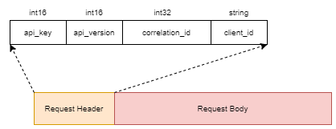
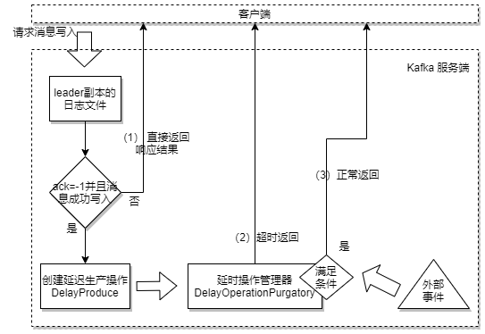
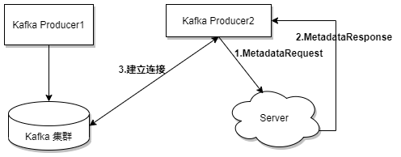

[TOC]

- 协议设计
- 时间轮
- 延迟操作
- 控制器
- 参数解密

# 6.1 协议设计

Kafka自定义一组基于TCP的二进制协议，只要遵守这组协议的格式，就可以向Kafka发送消息，可以从Kafka中拉取消息，或者其他动作，比如提交消费位移等；

包含43中协议，每种协议都有对应的请求和响应，每种类型的Request都包含相同结构的请求头(Request Header)和不同结构的协议请求体(Request Body)

# 6.2 时间轮

Kafka中存在大量的延时操作，比如延迟生产，延迟拉取和延迟删除；

它并没有基于JDK的Timer或DelayQueue来实现延迟功能而是基于时间轮的概念自定义实现了一个用于延时功能的定时器 ；

JDK的Timer和DelayQueue的插入和删除操作的平均时间复杂度均为O(nlogn)，并不能满足Kafka高性能的要求；而基于时间轮的插入和删除操作可以将时间复杂度将为O(1)。

**时间轮：**TimeWhel 是一个存储定时任务的环形队列，底层采用数组实现，数组中的每个元素存放一个定时任务列表 TimerTaskList；

**任务列表：** TimerTaskList 是一个环形的双向链表，链表中的每一项都是定时任务项 TimerTaskEntry，其中封装了真正的定时任务TimerTask；

时间轮由多个时间格组成，每个时间格代表当前时间轮的基本时间跨度 tickMs，时间格的个数固定，用wheelSize表示；

整个时间轮的时间跨度即为 wheelSize*tickMs；

时间轮有一个表盘指针，用来表示时间轮当前所处的时间 currentTime，它是tickMs的整数倍；currentTime将整个时间轮分为到期部分和未到期部分，它指向的时间格也属于到期部分，表示刚好到期，需要处理对应的TimerTaskList中的所有任务；

**多层级的时间轮**

假设tickMs=1ms，wheelSize=20，那么整个时间轮的跨度为interval=20ms。

初始化时currentTime指向时间格0，此时有一个定时为2ms的延迟任务插进来后，放入时间格为2的TimeTask；随着时间的推移，过了2ms后达到时间格2，会将此时的TimerTaskList中的任务进行响应的到期操作；此时如果有一个延迟时间为8ms的任务，那么它会放入时间格为10；如果同时有一个定时为19ms的任务插入进来怎么办？他会插入原来已经过期的时间格1；总之总体时间轮的总体跨度是不变的；当前时间轮所能处理的时间段也不断后移，总体时间范围在current和currentTime+interval之间；

如果此时有一个350ms的延迟任务达到怎么办？

此时超出了第一层时间轮的interval，因此会扩展出第二层的时间轮，它的tickMs=上一层的interval20ms，wheelSize=20，它的interval=400ms；以此类推第3层的时间总体跨度为8000ms；

**DelayQueue**

时间轮中的时间推进动作，是通过延迟队列实现的，DelayQueue

每个使用到的TimerTaskList会加入DelayQueue，DelayQueue会根据TimerTaskList对用的超时时间expiration排序，最短的TimerTaskList会排在队列头部；

Kafka中会有一个线程获取DelayQueue中到期的任务列表，线程的名称叫 ExpiredOperationReaper 过期操作收割机。

**DelayQueue+TimerWheel**

kafka用TimerWheel专门用来执行插入和删除TimerTaskEntity的操作，而DelayQueue专门负责时间推进的任务；

# 6.3 延时操作

如果生产者端设置ack=-1，即所有副本写入成功再返回；

此时，在leader写入成功后，会创建一个延迟生产操作DelayProduce，用来处理消息正常写入所有副本或超时的情况，以返回结果给客户端；

Kafka中有多种延迟操作，比如上面的延迟生产，还有延迟拉取，延时数据删除等；延时操作需要延时返回响应结果，它必须有一个超时时间，如果在该超时时间内没有完成既定任务，那么就需要强制完成以返回相应给客户端；

延时操作创建后会被加入到操作管理器来做专门的处理DelayedOperationPurgatory，延时操作又可能超时，每个延时操作都会配置一个定时器SystemTimer来做超时管理，定时器的底层就是采用时间轮实现的；时间轮的流转是靠线程ExpiredOperationReaper来驱动的，因此这里，定时器，收割机线程和延迟操作管理器都是一一对应的；

延迟生产

延迟拉取

触发时机，当follower副本从leader副本上拉取回的消息数目不够多的时候fetch.min.bytes默认1，就会创建一个延时拉取操作，以等待拉取到足够数量的消息；

延时拉取操纵也会有一个专门的延时操作管理器负责管理；

# 6.4 控制器

Kafka集群中有一个或多个broker，其中有一个会被选举为控制器，它负责管理整个集群的所有分区和副本的状态；

当某个分区的leader副本出现故障时，由控制器负责为该分区选举新的leader副本；

当检测到某个分区的ISR集合发生变化时，通知所有broker更新其元数据心思；

当使用脚本为某topic修改分区数目的时候，也是由控制器负责分区的重新分配；

## 6.4.1 控制器的选举和异常恢复

控制器的选举依赖zookeeper，成功金萱的broker会在zookeeper中创建/controller这个临时节点，内容为

{”version":1,"brokerId":0,"timetamp":.....}

在任意时刻集群中的控制器只有一个，每个broker启动的时候会尝试读取 /controller节点的brokerId的值，如果读取到的值不是-1，则表示已经有其他broker成功控制器，所以当前broker会放弃竞选；如果不存在这个节点，就会尝试创建该节点。如果同时有多个broker创建，那么只有一个会成功；

zookeeper中  /controller_epoch节点，持久节点，闭包是控制器发生变化的次数；

每个和控制器交互的请求都会携带controller_epoch值，用来保证控制器的唯一性；

控制器的职责：

- 监听分区的变化
- 监听主题相关堆地变化
- 监听broker的变化
- 启动并管理分区状态机和副本状态机
- 更新集群的元数据信息
- 定时维护分区的优先副本的均衡

## 6.4.2 优雅关闭

优雅关闭Kafka

脚本：kafka-server-stop.sh

原理是其实用了 kill -s TERM $PID

但是该脚本有时候并不奏效，原因是由于ps出来的Kafka内容相关的进程内容太多，超过了页内存；

解决办法：把脚本中的 /.Kafka去掉；

Kafka有一个关闭的钩子当Kafka进程捕获到终止信号的时候，会执行这个关闭钩子的内容，它会正常关闭一些必要的资源；

ControlledShutdown的执行过程

可以通过程序模拟ControlledShutdownRequest请求，以关闭相关的broker；

## 6.4.3 分区leader选举

分区副本的leader选举，由控制器负责完成；

**OfflinePartitionLeaderElectionStrategy 策略**

当创建分区(新增主题或增加分区数目)，或分区上线的时候都需要执行leader的选举动作；

选举策略为OfflinePartitionLeaderElectionStrategy，按照AR集合中副本的顺序查找**第一个存活的副本**(原顺序不变)，并且这个副本在ISR集合中；

**ReassignPartitionLeaderElectionStrategy 策略**

当分区重分配是也需要执行leader的选举，对应的选举策略为ReassignPartitionLeaderElectionStrategy，策略为 从**重分配的AR列表**中找到第一个存活的副本，并且该副本在ISR列表；

**PreferredRepicationPattitionLeaderElectionStrategy 策略**

当发生优先副本的选举时，直接将优先副本设置为leader即可；

**ControlledShutdownPartitionLeaderElectionStrategy 策略**

从AR列表中找到第一个存活的节点，并且节点在ISR中，如此同时该节点不是关闭的节点；

**什么是重分配？再均衡？**

重分配：对于某个主题的所有分区，重新分配到不同的broker上的过程；

再均衡：是消息消费端的策略，是将某主题的不同分区分配到不同的消费端的过程；

**什么情况下会发生重分配？再均衡？**

重分配：

1. 某个broker宕机；
2. 手动调整broker下线等；
3. 新增broker上线的时候，为了让各个节点之前的负载均衡，需要触发再分配；

再均衡：

1. 同一个消费者组的消费者数目发生变化的时候；消费者宕机下线，主动退出，新增等；
2. 分区数目发生变化的时候；
3. 消费者组对应的GroupCoordinator发生变化的时候；

**为什么要重分配？再均衡？**

重分配：当有broker宕机的时候保证副本的数目是副本因子数，保证系统的可靠性；当新增broker的时候，重分配可以让各个节点的负载更均衡；

再均衡：当消费者下线的时候，为了保证之前分配的消息可以正常消费；当消费者增加的时候，再均衡可以提高主题的消费的并行度；GroupCoordinator发生变化的时候，各个消费者需要通过再均衡过程，找到新的消费者组协调器；

**重分配的原理是什么？再均衡呢？**

重分配的原理是：控制器为每个分区的添加新的副本(增加副本因子)，新的副本将从分区的leader副本那里复制所有的数据；复制完成后，控制器将旧副本从副本清单中移除(恢复为原先的副本因子数)；

再均衡：第一阶段，每个消费者向Kafka服务端发送FindCoordinatorRequest请求，查询组协调器的节点；组协调器的节点为groupId.hashCode()%(__commit_offset的分区数目)分区所在的leader副本的broker；第二阶段，消费者发送JoinGroupRequest请求，请求加入消费者组，这里会同步发送每个消费者支持的分区策略，选举出leader消费者和最终的分配策略；第3阶段，SyncGroupRequest请求，每个消费者发送该请求同步分配策略，消费者组协调器会把分配策略发送给消费者；第4阶段，维持心跳阶段，并且在最开始需要知道每个消费者对应分区的起始消费位置发送OffsetFetchRequest请求。

控制器是干嘛的？

# 6.5 参数解密

## 6.5.1 broker.id

设置方式

- 修改配置文件  config/server.properties中的broker.id值；
- 或者 修改 logs/meta.properties文件 或者自动生成功能;

如果两者都配置，并且值不一样，会抛出错误；

如果没有meta.properties 会根据 server.properties中的内容自动生成；

自动生成的原理是：

先往 /brokers/seqid 节点中写入一个字符串null,然后获取返回的stat信息中的version值，将version的值和reserved.broker.max.id参数配置的值相加，先往数据中写入数据在获取stat信息，这样可以确保返回的version值大于0，可以确保自动生成的id值大于等该配置值；因此就保证了非自动生成的id值在[0,reserved.broker.max.id]区间设定；

查看broker.id方式：

查看zookeeper节点  /brokers/ids 会新建指定id的编号；

## 6.5.2 bootstrap.servers

不仅是Kafka Producer，Consumer客户端中的必备参数，而且在KafkaConnect，Kafka Streams，和KafkaAdminClient中都有涉及，是一个重要的参数。

可以认为该参数就是指定的将要链接的Kafka集群的broker地址列表，不过从深层意义上来讲，这个参数配置的是用来发现Kafka集群元数据信息的服务地址；

客户端和Kafka集群连接需要经历下面3个步骤：

1.客户端producer2 与 bootstrap.server指定的server建立连接，并发送MetadataRequest请求；

2.server收到请求，返回MetadataResponse，包含集群的元数据信息；

3.客户producer2收到response后，解析其中的集群元数据信息，然后与各个节点建立俩捏，之后就可以发送消息了；

我们完全可以把第一步二步中的server角色从Kafka中剥离出来，我们可以在这个server上大作文章，比如添加一些路由的功能，负载均衡的功能；

我们的这个服务的功能：

1.需要获取集群的信息的副本；

2.接收MetadataRequest请求，并返回MetadataResponse响应；对相关协议封装解析和包装；

